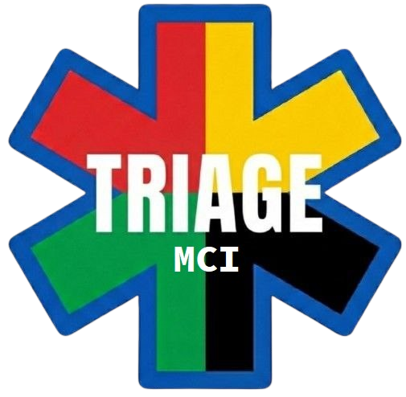

# TRIAGE MCI

System segregacji i zarządzania zdarzeniem masowym (Mass Casualty Incident).

Progresywna aplikacja webowa (PWA) działająca w pełni offline na urządzeniach z systemem iOS, Android i Windows.

Obsługuje 7 języków: polski, angielski, włoski, francuski, niemiecki, czeski, portugalski.



---

## Spis treści

- [Opis](#opis)
- [Funkcje](#funkcje)
- [Instalacja](#instalacja)
  - [Online (zalecane)](#online-zalecane)
  - [Offline — Windows](#offline--windows)
  - [Offline — iOS / Android](#offline--ios--android)
- [Jak używać](#jak-używać)
- [Tryb dyspozytora](#tryb-dyspozytora)
- [Struktura projektu](#struktura-projektu)
- [Technologie](#technologie)
- [English](#english)

---

## Opis

TRIAGE MCI to narzędzie do segregacji poszkodowanych podczas zdarzeń masowych, oparte na algorytmie **START** (Simple Triage and Rapid Treatment). Zaprojektowane zgodnie z **Procedurą MZ v2.3** (Ministerstwo Zdrowia, czerwiec 2024) — digitalizuje trzy obowiązkowe formularze papierowe: Tabelę Dyslokacji Poszkodowanych, Tabelę Szpitali i Raport GDM.

Aplikacja umożliwia:
- Segregację pacjentów wg protokołu START (T1–T4)
- Dokumentację obrażeń na interaktywnym diagramie ciała
- Zarządzanie transportem i dysponowanie zespołów ratowniczych
- Śledzenie pojemności szpitali (łóżka 🔴 T1 i 🟡 T2)
- Import danych od dyspozytora przez SMS/link
- Generowanie i wysyłanie raportów (SMS, email, schowek)
- Pracę w pełni offline — bez potrzeby połączenia z internetem

Wszystkie dane są przechowywane lokalnie w przeglądarce i przetrwają zamknięcie / restart aplikacji. Żadne informacje nie są wysyłane na zewnętrzne serwery.

---

## Funkcje

### Segregacja (Triage)
- 6-krokowy kreator decyzyjny START
- Klasyfikacja do 4 kategorii:
  - **T1 (Czerwony)** — Natychmiastowy — zagrożenie życia
  - **T2 (Żółty)** — Pilny — poważny, stabilny
  - **T3 (Zielony)** — Odroczony — lekkie obrażenia
  - **T4 (Czarny)** — Zgon / Expectant
- Ręczna zmiana koloru segregacji
- Automatyczne tagi pacjentów (P-001, P-002, ...)
- Płeć i wiek pacjenta
- Retriaż z potwierdzeniem i historią zmian (↺)
- Dymki pomocy kontekstowej (15 podpowiedzi)

### Diagram obrażeń ciała
- Interaktywny diagram SVG z widokiem przód/tył
- 9 stref ciała (głowa, klatka piersiowa, brzuch, ramiona, nogi)
- 7 typów obrażeń (złamanie, krwotok, oparzenie, rana, obrzęk, ból, amputacja)
- Podsumowanie obrażeń w karcie pacjenta i raporcie

### Dysponowanie (Dispatch)
- Modalne okna konfiguracji: KAM, GDM, zespoły ZRM, szpitale z pojemnością
- Przypisywanie zespołów ZRM do pacjentów
- Kierowanie do szpitali z informacją o zajętości (🔴/🟡 zajęte/całkowite)
- Zmiana szpitala w trakcie transportu z historią (⇄)
- Historia transportów
- Śledzenie statusu: Na miejscu → Transportowany → Dostarczony

### Import danych od dyspozytora
- Import przez link SMS (Base64, kompatybilny z GSM-7)
- Import przez wklejenie danych w modalu GDM
- Import w trakcie zdarzenia zachowuje pacjentów i KAM
- Automatyczne łączenie nazw zdarzeń (użytkownik | dyspozytor)

### Raport
- Podsumowanie statystyk wg kategorii segregacji
- Grupowanie pacjentów wg szpitali
- Historia retriażu i zmian szpitali
- Generowanie raportu tekstowego
- Kopiowanie do schowka, wysyłka SMS i email
- Zamknięcie i odwrócenie zamknięcia zdarzenia

### PWA i tryb offline
- Pełna funkcjonalność bez internetu
- Instalacja na ekranie głównym (iOS, Android, Windows)
- Automatyczny zapis danych w localStorage
- Wznawianie zdarzenia po zamknięciu aplikacji
- Potwierdzenia przed destrukcyjnymi akcjami
- 7 języków interfejsu (PL, EN, IT, FR, DE, CS, PT)

---

## Instalacja

### Online (zalecane)

1. Otwórz aplikację w przeglądarce (Chrome / Edge / Safari)
2. Zainstaluj jako PWA:
   - **Windows (Chrome / Edge)**: kliknij ikonę instalacji na pasku adresu
   - **Android (Chrome)**: tapnij ⋮ (menu) → Dodaj do ekranu głównego → Zainstaluj
   - **iOS (Safari)**: tapnij Udostępnij (⎙) → Dodaj do ekranu początkowego
3. Aplikacja działa offline od razu po pierwszym uruchomieniu

### Offline — Windows

Dla komputerów bez dostępu do internetu:

1. **Pobierz gotową paczkę:** [TRIAGE-MCI z GitHub Releases](https://github.com/0xjaqbek/triage/releases/latest)
   - Alternatywnie: kliknij zielony przycisk **Code** → **Download ZIP** na [stronie repozytorium](https://github.com/0xjaqbek/triage)
2. Rozpakuj i skopiuj folder na pendrive
3. Na docelowym komputerze uruchom `triage-server.exe`
4. Przeglądarka otworzy się automatycznie
5. Zainstaluj PWA z paska adresu
6. Zamknij serwer — aplikacja działa samodzielnie

Szczegółowa instrukcja: [INSTALACJA-OFFLINE.txt](INSTALACJA-OFFLINE.txt)

### Offline — iOS / Android

1. Podłącz urządzenie mobilne do tej samej sieci WiFi co komputer z uruchomionym `triage-server.exe`
2. Na komputerze sprawdź jego adres IP w sieci lokalnej
3. Na telefonie otwórz `http://<adres-ip>:8080`
4. Zainstaluj aplikację (Android: baner instalacji, iOS: Udostępnij → Dodaj do ekranu początkowego)

Alternatywnie: użyj hotspotu z telefonu, uruchom serwer na laptopie, otwórz na drugim urządzeniu.

---

## Jak używać

### Rozpoczęcie zdarzenia
1. Wybierz język interfejsu
2. Wpisz nazwę zdarzenia (np. "Wypadek A4 km 312")
3. Opcjonalnie wpisz imię KAM i włącz dymki pomocy
4. Kliknij **ROZPOCZNIJ TRIAGE**

### Segregacja pacjenta
1. Odpowiadaj TAK/NIE na pytania kreatora START
2. Wynik segregacji wyświetli się automatycznie
3. Opcjonalnie: zmień kolor ręcznie, dodaj płeć/wiek, zaznacz obrażenia na diagramie ciała, dodaj notatki
4. Kliknij **POTWIERDŹ PACJENTA** aby zapisać

### Dysponowanie transportu
1. Przejdź do zakładki **DYSPONOWANIE**
2. Skonfiguruj GDM, zespoły ZRM i szpitale z pojemnością (modalne okna przy pierwszym wejściu)
3. Wybierz pacjenta, zespół ZRM i szpital docelowy
4. Kliknij **DYSPONUJ TRANSPORT**
5. Oznacz pacjenta jako dostarczonego po dotarciu do szpitala

### Raport
1. Przejdź do zakładki **RAPORT**
2. Raport generuje się automatycznie (statystyki, pacjenci wg szpitali, historia retriażu)
3. Skopiuj do schowka lub wyślij przez SMS/email

### Wznawianie zdarzenia
- Przy ponownym uruchomieniu aplikacja wykryje zapisane dane
- Kliknij **KONTYNUUJ** aby wrócić do zdarzenia
- Kliknij **NOWE ZDARZENIE** aby rozpocząć od nowa (wymaga potwierdzenia)

Pełna instrukcja obsługi dostępna w aplikacji (przycisk **📖 Instrukcje** w panelu informacyjnym) oraz w katalogu [docs/](docs/instrukcja.md).

---

## Tryb dyspozytora

Dostępny przez link na ekranie startowym lub pod adresem `/dyspozytor/`.

Umożliwia operatorowi centrali przygotowanie i wysyłkę danych dla zespołu w terenie:
- Nazwa zdarzenia i GDM
- Lista zespołów ZRM
- Szpitale docelowe z pojemnością (🔴/🟡)

Dane kodowane w Base64 (GSM-7), mieszczą się w ~10 segmentach SMS (~20 szpitali + 20 zespołów). Wysyłka przez SMS lub kopiowanie do schowka.

---

## Struktura projektu

```
triage/
├── index.html              # Aplikacja (HTML + CSS + JS w jednym pliku)
├── manifest.json           # Manifest PWA
├── sw.js                   # Service Worker (cache-first, tryb offline)
├── triage.png              # Logo
├── triage-server.exe       # Serwer lokalny do instalacji offline
├── INSTALACJA-OFFLINE.txt  # Instrukcja instalacji offline
├── icons/                  # Ikony PWA (192, 512, apple-touch)
├── dyspozytor/
│   └── index.html          # Strona trybu dyspozytora
├── instrukcja/
│   └── index.html          # Instrukcja obsługi (7 języków)
├── privacy/
│   └── index.html          # Polityka prywatności
├── server/
│   └── main.go             # Kod źródłowy serwera Go
└── docs/
    ├── instrukcja.md        # Instrukcja PL
    ├── instruction-*.md     # Instrukcje EN, IT, FR, DE, CS, PT
    ├── thesis/              # Rozdziały pracy magisterskiej
    └── plans/               # Dokumentacja techniczna
```

---

## Technologie

- **HTML/CSS/JS** — bez frameworków, bez zależności zewnętrznych
- **Service Worker** — strategia cache-first, pełny tryb offline
- **Web App Manifest** — instalacja na ekranie głównym
- **localStorage** — persystencja danych między sesjami
- **Base64 / GSM-7** — kodowanie danych do przesyłu SMS
- **Go** — przenośny serwer HTTP do instalacji offline

---

## Licencja

Projekt udostępniony na licencji **GNU General Public License v3.0** z dodatkowym zastrzeżeniem:

> **Komercyjna redystrybucja (sprzedaż) tej aplikacji jest zabroniona.**
> TRIAGE MCI jest narzędziem ratowniczym i powinien pozostać darmowy.

Możesz swobodnie: używać, kopiować, modyfikować i udostępniać tę aplikację, pod warunkiem że:
- Zachowasz informację o autorze
- Udostępnisz kod źródłowy zmian na tej samej licencji (GPLv3)
- Nie będziesz sprzedawać aplikacji ani jej modyfikacji

Pełna treść licencji: [LICENSE](LICENSE)

---

## Wesprzyj projekt

Jeśli TRIAGE MCI jest pomocny w Twojej pracy, możesz postawić mi kawę:

[☕ Buy me a coffee](https://buycoffee.to/jaqbek)

---

## English

### What is TRIAGE MCI?

A Progressive Web App (PWA) for managing mass casualty incidents using the START triage protocol. Designed in accordance with the Polish **Ministry of Health Procedure v2.3** (June 2024) — digitizes three mandatory paper forms: Patient Dislocation Table, Hospital Table, and GDM Report.

Fully functional offline on iOS, Android, and Windows. Supports 7 languages: Polish, English, Italian, French, German, Czech, Portuguese.

### Features
- **START triage wizard** — 6-step decision tree classifying patients into T1 (Red/Immediate), T2 (Yellow/Urgent), T3 (Green/Delayed), T4 (Black/Deceased)
- **Body injury diagram** — interactive SVG with 9 zones, 7 injury types, front/back views
- **Dispatch system** — assign EMS teams to patients, route to hospitals with RED/YELLOW capacity tracking, transport status tracking
- **Dispatcher data import** — receive crew/hospital data from dispatch center via SMS link (Base64/GSM-7) or paste
- **Dispatcher page** (`/dyspozytor/`) — standalone form for dispatch center to prepare and send data
- **Reports** — auto-generated incident report with per-hospital grouping, retriage history, SMS/email/clipboard export
- **Retriage** — category change with confirmation dialog and full history tracking
- **Full offline support** — service worker caches all assets, works without internet after first visit
- **Data persistence** — all state saved to localStorage, survives app restarts
- **Confirmation dialogs** — prevents accidental deletion of patients, teams, or hospitals
- **Contextual help** — 15 help bubbles across all screens, toggleable from start screen
- **Multi-language** — PL, EN, IT, FR, DE, CS, PT
- **Built-in instructions** — user manual accessible from info panel in all 7 languages
- **Cross-platform install** — installable as PWA on Android, iOS, and Windows

### Offline installation (no internet)

Download the ready-to-use package from **[GitHub Releases](https://github.com/0xjaqbek/triage/releases/latest)** (or use Code → Download ZIP from the [repository page](https://github.com/0xjaqbek/triage)).

Copy the folder to the target device, run `triage-server.exe`, install the PWA from localhost, and close the server. The app runs independently after that. See [INSTALACJA-OFFLINE.txt](INSTALACJA-OFFLINE.txt) for details.

### Tech stack
Vanilla HTML/CSS/JS (no frameworks), Service Worker, Web App Manifest, localStorage, Base64/GSM-7 encoding, Go (portable HTTP server).

### License
GPLv3 with an additional non-commercial clause: **commercial redistribution (selling) of this application is prohibited.** TRIAGE MCI is a rescue tool and should remain free. See [LICENSE](LICENSE) for full terms.

### Support
If TRIAGE MCI is useful in your work: [☕ Buy me a coffee](https://buycoffee.to/jaqbek)

---

## Kontakt

Zgłoszenia i propozycje ulepszeń: [jaqbek.eth@gmail.com](mailto:jaqbek.eth@gmail.com)
